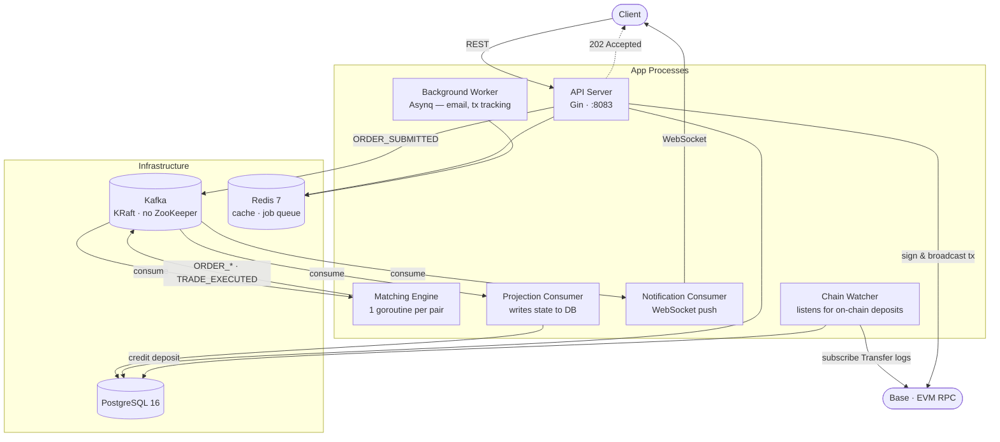

# CoinHub

CoinHub is a foundation for building centralized exchanges on top of EVM networks. Instead of spending months wiring up order matching, wallet generation, user auth, and blockchain event listening, you get all of that out of the box so you can focus on your product.

The exchange runs as a set of independent Go processes (API, engine, workers) communicating through Kafka — so you can scale or replace each piece without touching the rest.

---

## What's included

### Order Matching Engine

The heart of the system. The engine runs fully in-memory — no database round-trips during matching — and processes each trading pair on its own goroutine. Orders come in through Kafka (`ORDER_SUBMITTED`), get routed to the right pair worker, matched, and the resulting events (`ORDER_PARTIAL`, `ORDER_FILLED`, `TRADE_EXECUTED`) are published back to Kafka for projection and notification consumers to pick up.

Supported order types: **limit**, **market**, **cancel**.

Matching follows price-time priority with self-trade prevention. Partial fills are supported — any unfilled remainder of a limit order rests on the book at the given price level.

**Order book structure:** Price levels use a B-Tree, giving O(log n) insertion and lookup instead of O(n) scans — critical for deep books under high load.

The flow end-to-end:
```
POST /order/limit
    → SubmitOrder (usecase)
    → Kafka ORDER_SUBMITTED
    → orderMainConsumer (engine process)
    → OrderRouter (fan-out by pair)
    → orderHandlerWorker (one goroutine per pair)
    → Orderbook.MatchLimit / MatchMarket / Cancel
    → Kafka ORDER_* + TRADE_EXECUTED
    → Projection consumer (writes to DB)
    → Notification consumer (pushes WebSocket updates)
```

HTTP handlers return `202 Accepted` immediately. Matching is asynchronous.

---

### Wallet & On-chain Accounts

Users get a deterministic EVM wallet address on registration, derived from a single HD wallet mnemonic using BIP-44 (`m/44'/60'/0'/0/<index>`). You hold the mnemonic, users hold their balances on-chain.

The `watcher` process listens for ERC-20 transfer events on-chain and automatically credits deposits to user accounts. Withdrawals are signed server-side and submitted as EIP-1559 transactions.

Supported networks: Base mainnet and Base Sepolia, switchable via `NETWORK_STATUS` env var.

---

### Authentication

- Username/password with bcrypt
- Gmail-based login with email verification codes (sent via SMTP, stored in Redis with TTL)
- JWT tokens on all protected routes
- Role-based access: `user`, `admin`, `system`

---

### Real-time Updates

A WebSocket endpoint (`GET /v1/order/events/ws`) pushes order status changes to connected clients. The notification consumer reads `ORDER_*` events from Kafka and broadcasts to the relevant user's connection. There's also a blockchain WebSocket client that streams on-chain transfer events.

---

### Admin Panel

A back-office interface mounted at `/admin`, powered by GoAdmin. Provides out-of-the-box UI to manage admin users, roles, permissions, and operation logs. Access requires a GoAdmin account (separate from the exchange user accounts).

Default credentials (development): `admin` / `admin`

---

### Observability

Prometheus metrics are exposed at `/metrics` and cover: orders submitted/matched/cancelled/expired per pair, reaper removal failures, trades executed, Kafka events consumed, and HTTP request latency. A Grafana setup with provisioned dashboards is included in `/monitoring`.

Background jobs (email codes, pending transaction tracking) run through Asynq (Redis-backed), with a monitoring UI at `/monitoring`.

---

## Architecture



Each process (`api`, `engine`, `worker`, `order-projection-consumer`, `notification-consumer`, `watcher`) runs independently. Kafka is the shared backbone — the engine never touches the database directly, and all state changes flow through events.

---

## Stack

| Layer | Choice |
|---|---|
| Language | Go 1.25 |
| HTTP | Gin |
| Database | PostgreSQL 16 (GORM) |
| Message broker | Kafka (KRaft, no ZooKeeper) |
| Cache / queues | Redis 7 |
| Blockchain | go-ethereum, HD wallet (BIP-44) |
| Metrics | Prometheus + Grafana |
| Background jobs | Asynq |
| Config | cleanenv (`.env` file) |

---

## Setup

### Prerequisites

- Docker & Docker Compose
- An Alchemy (or compatible) RPC key for Base mainnet/Sepolia
- A Gmail app password if you want email auth

### 1. Configure

Copy the example env and fill in your secrets:

```bash
cp .env.docker .env
```

Required values to change before first boot:

```env
APP_JWT_SECRET=<random string>
HDWALLET_MNEMONIC=<your 12/24 word mnemonic>  # keep this secret and backed up

# Alchemy RPC endpoints
ETH_CLIENT_MAINNET=https://base-mainnet.g.alchemy.com/v2/<key>
ETH_CLIENT_TESTNET=https://base-sepolia.g.alchemy.com/v2/<key>
WS_CLIENT_ETHEREUM_MAINNET=wss://base-mainnet.g.alchemy.com/v2/<key>
WS_CLIENT_ETHEREUM_TESTNET=wss://base-sepolia.g.alchemy.com/v2/<key>

# Email (optional — only needed for Gmail auth)
MAIL_SMTP_USERNAME=your@gmail.com
MAIL_SMTP_PASSWORD=<gmail app password>
```

Switch between testnet and mainnet:

```env
NETWORK_STATUS=TESTNET   # or MAINNET
```

### 2. Run

```bash
docker compose build
docker compose up -d
```

This starts the full stack: Postgres, Redis, Kafka, all app processes, Prometheus, and Grafana.

To bring up only the API (if you're running infrastructure separately):

```bash
docker compose up -d api
```

### 3. Run migrations manually

```bash
go run main.go migrate
```

Migrations live in `/migrations` and run automatically in the Docker setup via the `migrate` service.

---

## Running processes individually

Each process is a subcommand:

```bash
go run main.go api                        # HTTP server (port 8083)
go run main.go engine                     # order matching engine
go run main.go worker                     # background job worker (Asynq)
go run main.go order-projection-consumer  # persists Kafka events to DB
go run main.go notification-consumer      # pushes events to WebSocket clients
go run main.go watcher                    # on-chain deposit listener
```

---

## API

All routes are under `/v1`.

| Method | Path | Auth | Description |
|---|---|---|---|
| `POST` | `/auth/register` | — | Register a new user |
| `POST` | `/auth/login/username` | — | Login with username + password |
| `POST` | `/auth/login/gmail` | — | Start Gmail login flow |
| `POST` | `/auth/verify/gmail-code` | — | Verify email code |
| `POST` | `/order/limit` | JWT | Place a limit order |
| `POST` | `/order/market` | JWT | Place a market order |
| `DELETE` | `/order/cancel` | JWT | Cancel an open order |
| `GET` | `/order/events/ws` | JWT | WebSocket — order updates |
| `POST` | `/transaction/withdraw` | JWT | Withdraw funds on-chain |
| `POST` | `/system/operation/asset/add` | Admin | Create a new asset |
| `GET` | `/health` | — | Health check |
| `GET` | `/metrics` | — | Prometheus metrics |

Full Swagger docs are available at `/swagger/index.html` when running.

---

## Monitoring

| Service | URL |
|---|---|
| Grafana | `http://localhost:3000` (admin / coinhub) |
| Prometheus | `http://localhost:9090` |
| Kafka UI | `http://localhost:8080` |
| Asynqmon (job monitor) | `http://localhost:8083/v1/monitoring` |
| Admin panel | `http://localhost:8083/admin` |

---

## Adding a trading pair

1. Insert the base and quote assets via `POST /system/operation/asset/add` (requires admin token)
2. Insert the trading pair record in the database (migration or seed script)
3. Restart the engine — it reads active pairs at startup and creates an order book + goroutine per pair. Kafka topics are auto-created.

---

## Roadmap

### Completed

- [x] B-Tree for order book price levels — O(log n) insertion/lookup replaces O(n) slice scans (`internal/engine/orderbook.go`)
- [x] Admin panel — back-office UI for managing users, roles, and permissions (`/admin`)
- [x] Asset creation endpoint — `POST /v1/system/operation/asset/add` (admin only)

### Features

- [ ] Asset info endpoints — public routes to query a single asset and list all assets with their network availability, trading pairs, and status (`internal/adapter/handler/http/asset.go`)
- [ ] Multi-network config — currently hardcoded to support two networks simultaneously (`internal/infrastructure/configs/configs.go`)
- [x] Graceful shutdown — all processes handle SIGTERM/SIGINT; HTTP server drains in-flight requests with a 10s timeout; `app.Shutdown()` closes DB pool, Redis, ETH clients, Asynq, and Kafka producer in order (`cmd/api.go`, `internal/application.go`)
- [x] Order expiration — a reaper goroutine (min-heap, 100ms tick) removes GTC orders past their `expires_at`, publishes `ORDER_EXPIRED` to Kafka, and the projection consumer updates the DB status to `expired`

### Security

- [ ] Lock down WebSocket CORS — remove `InsecureSkipVerify` and restrict to actual origins (`internal/adapter/handler/http/router.go`)
- [ ] Set trusted proxy addresses for `X-Forwarded-For` (load balancer IP) (`internal/adapter/handler/http/router.go`)
- [ ] Sentry integration for crash reporting in production (`internal/adapter/handler/http/router.go`)

---

## License

MIT
